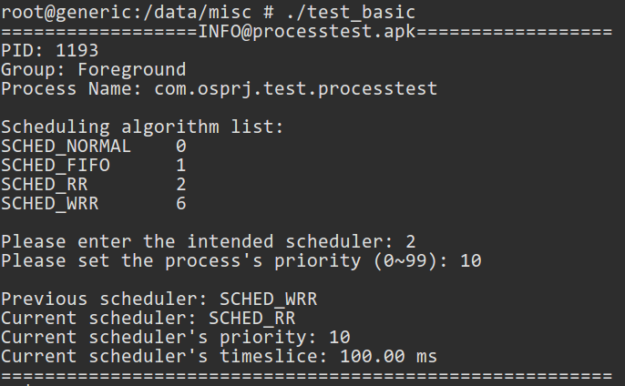
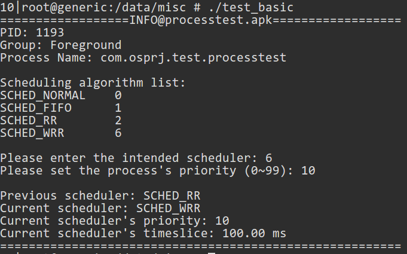
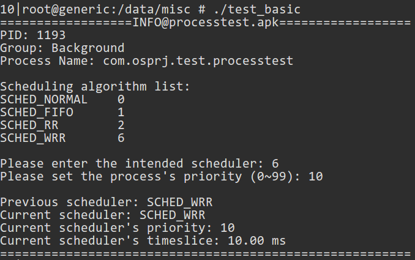
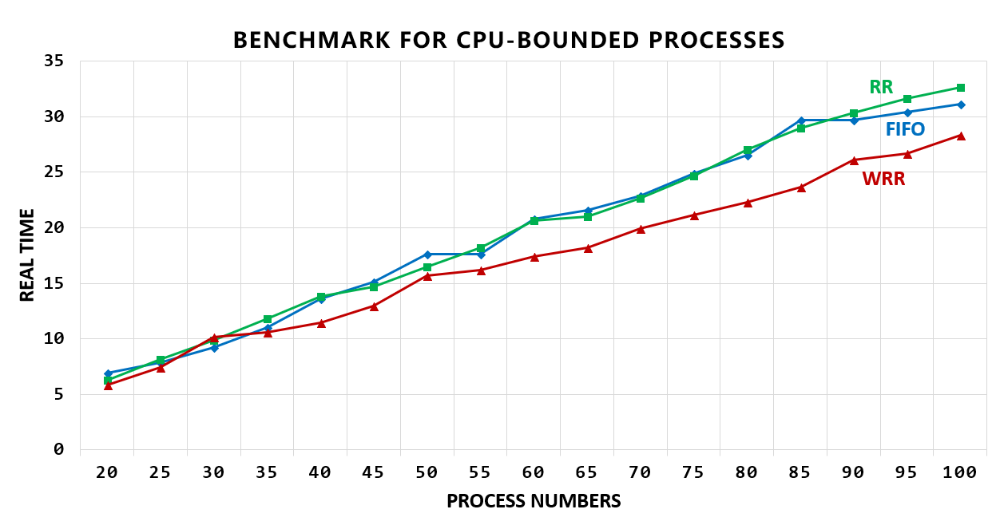
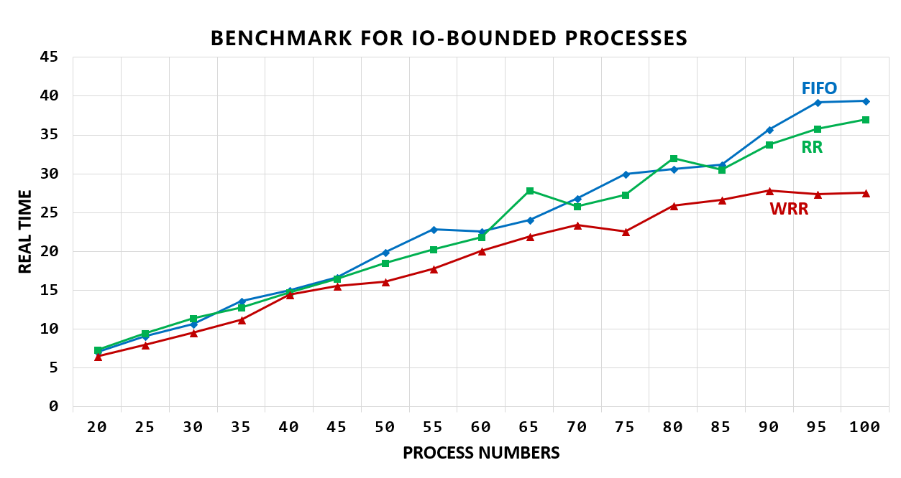
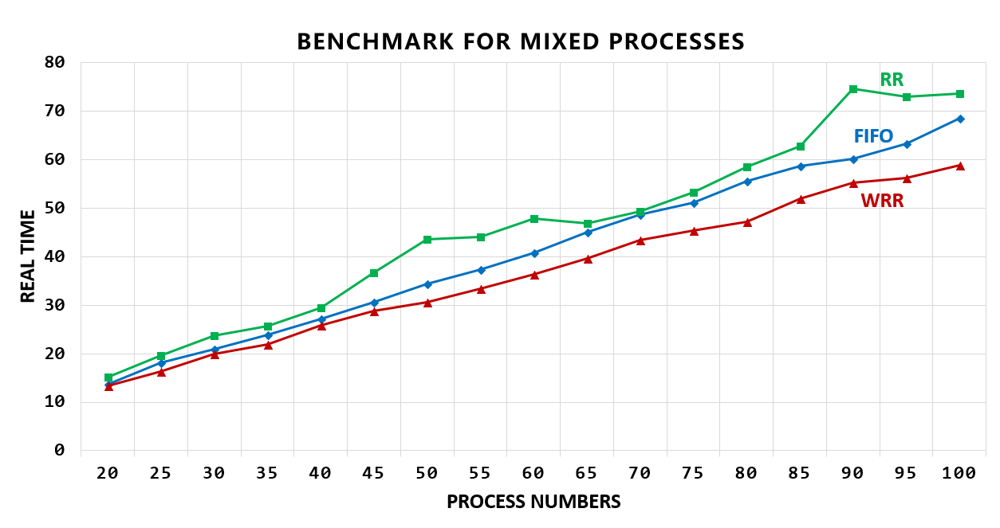

# OS-Project2 Report

## 1.  Overview

### 1.1  Workspace

```c
├── basic		/* basic part of the project */
│   ├── kernel		/* modified kernel folder */
│   │   ├── goldfish_armv7_defconfig	/* /arch/arm/configs/goldfish_armv7_defconfig */
│   │   ├── linux	
│   │   │   └── sched.h		/* /include/linux/sched.h */
│   │   └── sched
│   │       ├── core.c		/* /kernel/sched/core.c */
│   │       ├── Makefile	/* /kernel/sched/Makefile */
│   │       ├── rt.c		/* /kernel/sched/rt.c */
│   │       ├── sched.h		/* /kernel/sched/sched.h */
│   │       └── wrr.c		/* /kernel/sched/wrr.c - main part of the project */
│   └── test_basic		/* test folder for basic part */
│       ├── jni
│       │   ├── Android.mk		/* android makefile */
│       │   └── test.c		/* source file for basic test */
│       ├── libs
│       │   └── armeabi
│       │       └── test_basic		/* executable file */
│       └── obj
│           └── local
│               └── armeabi
│                   ├── objs
│                   │   └── test_basic
│                   │       ├── test.o
│                   │       └── test.o.d
│                   └── test_basic
├── bonus		/* bonus part of the project */
│   ├── acquire_output		/* acquiring output folder */
│   │   ├── jni
│   │   │   ├── acquire_output.c	/* source file that produces benchmark data */
│   │   │   └── Android.mk		/* android makefile */
│   │   ├── libs
│   │   │   └── armeabi
│   │   │       └── acquire_output		/* executable file */
│   │   └── obj
│   │       └── local
│   │           └── armeabi
│   │               ├── acquire_output
│   │               └── objs
│   │                   └── acquire_output
│   │                       ├── acquire_output.o
│   │                       └── acquire_output.o.d
│   ├── benchmark_cpubound		/* benchmark for CPU-Bound folder */
│   │   ├── jni
│   │   │   ├── Android.mk		/* android makefile */
│   │   │   └── cpu-bound.c		/* source file for CPU-Bound benchmark */
│   │   ├── libs
│   │   │   └── armeabi
│   │   │       └── test_cpubound		/* executable file */
│   │   └── obj
│   │       └── local
│   │           └── armeabi
│   │               ├── objs
│   │               │   └── test_cpubound
│   │               │       ├── cpu-bound.o
│   │               │       └── cpu-bound.o.d
│   │               └── test_cpubound
│   ├── benchmark_iobound		/* benchmark for IO-Bound folder */
│   │   ├── jni
│   │   │   ├── Android.mk		/* android makefile */
│   │   │   ├── data_in			/* read-in file */
│   │   │   └── io-bound.c		/* source file for IO-Bound benchmark */
│   │   ├── libs
│   │   │   └── armeabi
│   │   │       └── test_iobound	/* executable file */
│   │   └── obj
│   │       └── local
│   │           └── armeabi
│   │               ├── objs
│   │               │   └── test_iobound
│   │               │       ├── io-bound.o
│   │               │       └── io-bound.o.d
│   │               └── test_iobound
│   ├── benchmark_mixed		/* benchmark for Mixed folder */
│   │   ├── jni
│   │   │   ├── Android.mk		/* android makefile */
│   │   │   └── mixed.c		/* source file for Mixed benchmark */
│   │   ├── libs
│   │   │   └── armeabi
│   │   │       └── test_mixed		/* executable file */
│   │   └── obj
│   │       └── local
│   │           └── armeabi
│   │               ├── objs
│   │               │   └── test_mixed
│   │               │       ├── mixed.o
│   │               │       └── mixed.o.d
│   │               └── test_mixed
│   └── data_preprocessing		/* data preprocessing folder */
│       ├── dataPreprocess.py	/* source file for data preprocessing */
│       ├── raw_data	/* raw data folder produced by acquire_data */
│       │   ├── cpu_output.txt
│       │   ├── io_output.txt
│       │   └── mixed_output.txt
│       └── tidy_data	/* tidy data after preprocessing */
│           ├── cpu_output.xls
│           ├── io_output.xls
│           └── mixed_output.xls
├── README.md	/* This file */
├── report.md	/* Markdown version report */
├── report.pdf	/* Pdf version report */
└── src
    ├── cpubound.PNG	/* visualization for CPU-Bound benchmark */
    ├── iobound.PNG		/* visualization for IO-Bound benchmark */
    ├── mixed.PNG		/* visualization for Mixed benchmark */
    ├── test_basic_1.PNG	/* test_basic screencapture 1 */
    ├── test_basic_2.PNG	/* test_basic screencapture 2 */
    └── test_basic_3.PNG	/* test_basic screencapture 3 */

54 directories, 54 files
```
### 1.2  Main Work  
- **MAIN PART**

  **`/kernel/sched/wrr.c`**

  - Firstly, judge whether it is a foreground task or background task.
  - Secondly, allocate corresponding time slice to it.

- **TO REVISE**

  - `/arch/arm/configs/goldfish_armv7_defconfig`
  - `/include/linux/sched.h`
  - `/kernel/sched/sched.h`
  - `/kernel/sched/core.c`
  - `/kernel/sched/rt.c`
  - `/kernel/sched/Makefile`

- **TEST PART**

  - `test_basic.c`

- **BENCHMARK PART**

  - `cpu-bound.c`
  - `io-bound.c`
  - `mixed.c`
  - `acquire_output.c`
  - `dataPreprocess.py`

## 2.  Installation

### 2.1  Basic

1. Compile the kernel

```shell
cd ~/kernel/goldfish
make -j8
```

2. Start android virtual machine with modified kernel

```shell
emulator -avd OsPrj-StudentID -kernel ~/kernel/goldfish/arch/arm/boot/zImage -show-kernel
```

3. Build test_basic and push it into machine

```shell
cd /test_basic
ndk-build
cd ./libs/armeabi
adb push test_basic /data/misc
```

4. Run the test file

```shell
cd /data/misc
./test_basic
```

### 2.2  Benchmark (Bonus)

#### 2.2.1  Benchmark Creating

1. The first two steps are the same as basic part.
2. Build three benchmark programs and push them into machine

```shell
cd /benchmark_cpubound
ndk-build
cd ./libs/armeabi
adb push test_cpubound /data/misc
```

```shell
cd /benchmark_iobound
ndk-build
cd ./libs/armeabi
adb push test_iobound /data/misc
```

```shell
cd /benchmark_mixed
ndk-build
cd ./libs/armeabi
adb push test_mixed /data/misc
```

3. Run the benchmark program

- **Benchmark CPU-Bound**

```shell
cd /data/misc
time -p ./test_cpubound ITERATIONS SCHED_POLICY PROC_COUNT
```

- **Benchmark IO-Bound**

```shell
cd /data/misc
time -p ./test_iobound SCHED_POLICY SRC DEST BLOCK_SIZE TRAN_SIZE PROC_COUNT
```

- **Benchmark Mixed**

```shell
cd /data/misc
time -p ./test_mixed ITERATIONS SCHED_POLICY PROC_COUNT BLOCK_SIZE TRAN_SIZE SRC DEST
```

Note that we set ITERATIONS is at least 100, and PROC_COUNT is at most 5000.

#### 2.2.2  Acquire Outputs

1. The first two steps are the same as basic part.
2. Build the acquiring outputs program and push it into machine

```shell
cd /acquire_output
ndk-build
cd ./libs/armeabi
adb push acquire_output /data/misc
```

3. Run the acquiring outputs program

```shell
cd /data/misc
./acquire_output
```

4. Extract time information outputs of CPU-Bound, IO-Bound and Mixed benchmark with varied tasks.

#### 2.2.3  Data Preprocessing

1. Put the collected raw data into folder `raw_data`.
2. Install Python package `xlwt` to Python interpreter.
3. Run the data preprocessing program.

```shell
python3 dataPreprocess.py
```

## 3.  Modifications in other files

### 3.1  /arch/arm/configs/goldfish_armv7_defconfig

####3.1.1  Configure WRR_GROUP_SCHED

```c
CONFIG_WRR_GROUP_SCHED=y
```

In this file, we enable the configuration of WRR group scheduling to activate wrr group scheduling code sections.

### 3.2  /include/linux/sched.h

####3.2.1  Define SCHED_WRR 

  ```c
#define SCHED_WRR       6 
  ```

This part is to assign a new number for WRR scheduling policy.

#### 3.2.2  Declare wrr_rq struct

```c
struct wrr_rq;
```

#### 3.2.3  Define sched_wrr_entity

```c
struct sched_wrr_entity {
	struct list_head run_list;
	unsigned long timeout;
	unsigned int time_slice;

	struct sched_wrr_entity *back;
	struct sched_wrr_entity	*parent;
	/* rq on which this entity is (to be) queued: */
	struct wrr_rq		*wrr_rq;
	/* rq "owned" by this entity/group: */
	struct wrr_rq		*my_q;
};
```

This part is to define the scheduling entity for WRR policy, which acts as an abstract entity for task(s) and can be directly operated by scheduler for the purpose of scheduling. Note that through `run_list` , we can link different entities into a list that forms a run queue (rq) for scheduler.

#### 3.2.4  Define idertifiers for foreground and background groups

```c
#define FOREGROUP	"/"
#define BACKGROUP	"/bg_non_interactive"
```

####3.2.5  Define time slice for foreground and background groups 

```c
#define WRR_FORE_TIMESLICE		(100 * HZ / 1000)
#define WRR_BACK_TIMESLICE		(10 * HZ / 1000) 
```

Note that 100ms for foreground group and 10ms for background group.

#### 3.2.6  Add a sched_wrr_entity variable to task_struct

```c
struct sched_wrr_entity wrr;
```

### 3.3  /kernel/sched/sched.h

#### 3.3.1  Add wrr_policy function

```c
static inline int wrr_policy(int policy)
{
	if (policy == SCHED_WRR)
		return 1;
	return 0;
}
```

This function is to check whether the current scheduling policy is WRR.

#### 3.3.2  Declare wrr_rq struct

```c
struct wrr_rq;
```

#### 3.3.3  Declare some extern functions

```c
extern void free_wrr_sched_group(struct task_group *tg);
extern int alloc_wrr_sched_group(struct task_group *tg, struct task_group *parent);
```

####3.3.4  Define wrr_rq struct 

```c
struct wrr_rq {
	unsigned int wrr_nr_running; /* number of entities in wrr_rq */

	struct rq *rq; /* pointer to general run queue */
	struct list_head queue; /* entity queue of wrr_rq */
	struct list_head leaf_wrr_rq_list;
	struct task_group *tg;
};
```

This part is to define `wrr_rq` struct for WRR scheduling, where `wrr_nr_running` denotes the number of entities in `wrr_rq`. Meanwhile, it owns a pointer to the general run queue and an entity queue of itself. Note that this struct will be frequently used in `wrr.c` file.

#### 3.3.5  Add wrr_rq variable to rq together with a list_head variable

```c
struct wrr_rq wrr;

#ifdef CONFIG_WRR_GROUP_SCHED
	struct list_head leaf_wrr_rq_list;
#endif
```

####3.3.6  Declare some extern variables

```c
extern const struct sched_class wrr_sched_class;
```

### 3.4  /kernel/sched/core.c

#### 3.4.1  Revise __sched_fork

```c
INIT_LIST_HEAD(&p->wrr.run_list);
```

The part is to initialize the list_head `run_list` of `sched_wrr_entity` of the task.

#### 3.4.2  Revise __setscheduler

```c
if (p->policy == SCHED_WRR)
	p->sched_class = &wrr_sched_class;
else if (rt_prio(p->prio))
	p->sched_class = &rt_sched_class;
else
	p->sched_class = &fair_sched_class;
```

In this part, we set the scheduler for the chosen task according to the given policy and priority.

####  3.4.3  Revise __sched_setscheduler

```c
if (policy != SCHED_FIFO && policy != SCHED_RR &&
		policy != SCHED_NORMAL && policy != SCHED_BATCH &&
		policy != SCHED_WRR && policy != SCHED_IDLE)
	return -EINVAL;
```

```c
if ((rt_policy(policy) != (param->sched_priority != 0) && 
     	(wrr_policy(policy) != (param->sched_priority != 0))))
	return -EINVAL;
```

In this part, we add some checking properties for WRR scheduling in case some original exceptions.

#### 3.4.4  Revise SYSCALL_DEFINE1 sched_get_priority_max

```c
#define MAX_USER_WRR_PRIO	 100 /* define in /include/linux/sched.h */
case SCHED_WRR:
	ret = MAX_USER_WRR_PRIO-1;
	break;
```

In this part, we add the definition of max priority for WRR scheduling to prepare for the calls in test file and benchmark file.

####3.4.5  Add init_wrr_rq function 

```c
void init_wrr_rq(struct wrr_rq *wrr_rq)
{
	INIT_LIST_HEAD(&wrr_rq->queue);
	wrr_rq->wrr_nr_running = 0;
}
```

In this part, we initialize `wrr_rq` by initializing its list_head `queue` and setting `wrr_nr_running` to 0.

#### 3.4.6  Revise free_sched_group

```c
free_wrr_sched_group(tg);
```

#### 3.4.7  Revise sched_create_group

```c
if (!alloc_wrr_sched_group(tg, parent))
	goto err;
```

###  3.5  /kernel/sched/rt.c

####3.5.1  Revise rt_sched_class 

```c
const struct sched_class rt_sched_class = {
     /* set the priority of wrr_sched_class next to rt_sched_class */
	.next			= &wrr_sched_class, 
	.enqueue_task		= enqueue_task_rt,
	.dequeue_task		= dequeue_task_rt,
	.yield_task		= yield_task_rt,

	.check_preempt_curr	= check_preempt_curr_rt,

	.pick_next_task		= pick_next_task_rt,
	.put_prev_task		= put_prev_task_rt,
......
```

In this part, we modify the next scheduled class of `rt_sched_class` to `wrr_sched_class` , which means we eventually change the priority order between different scheduled classes (different policies) , making `wrr_sched_class` right follow `rt_sched_class` while ahead of `fair_sched_class`. Therefore, when using `for_each_class` function to traverse all scheduled classes, it observes the newly modifed order to pick next task to execute, that is, the scheduler core will attempt to schedule all runnable tasks from each class before moving on to the next class in the hierarchy.

###3.6  /kernel/sched/Makefile  

#### 3.6.1  Link wrr.o

```makefile
obj-y += core.o clock.o idle_task.o fair.o rt.o stop_task.o wrr.o
```

## 4.  Work on wrr.c

### 4.1  enqueue_task_wrr

#### 4.1.1  Function

Add a new task to the run queue. When the task is ready, the function will be executed.

#### 4.1.2  Implementation

- Firstly, acquire the scheduled entity of this task.
- Secondly, add this entity into the list of `wrr_rq`.
- Lastly, increase both `wrr_nr_running` and `nr_running` by 1.

### 4.2  dequeue_task_wrr

#### 4.2.1  Function

Remove a task from the run queue. When the task is terminated, the function will be executed.

#### 4.2.2  Implementation

- Firstly, acquire the scheduled entity of this task.
- Secondly, update the current task's runtime statistics using function `update_curr_wrr`.
- Thirdly, remove this entity from the list of `wrr_rq`.
- Lastly, decrease both `wrr_nr_running` and `nr_running` by 1.

### 4.3  yield_task_wrr

#### 4.3.1  Function

When the current task intends to give up the control of CPU resources voluntarily, the function will be executed.

#### 4.3.2  Implementation

Function `yield_task_wrr` will call function `requeue_task_wrr` to remove the scheduled entity of current task from the list of `wrr_rq`.

### 4.4  pick_next_task_wrr

#### 4.4.1  Function

Pick the next ready task in ` wrr_rq` to execute.

#### 4.4.2  Implementation

- Firstly, make sure there exists task in `wrr_rq` by checking the number of `wrr_nr_running`.
- Secondly, obtain the next scheduled entity in `wrr_rq` using function `list_first_entry`.
- Thirdly, acquire the task item through its scheduled entity using function `container of`.
- Lastly, set some properties of the task and return it.

### 4.5  put_prev_task_wrr

#### 4.5.1  Function

Put the task back to `wrr_rq`.

#### 4.5.2  Implementation

- Firstly, update the task's runtime statistics using function `update_curr_wrr`.
- Secondly, set the starting execution time of the task to 0.

### 4.6  task_fork_wrr

#### 4.6.1  Function

From a task we fork another task, the function will be executed.

#### 4.6.2  Implementation

After forking, set some properties for the new task according to its parent's properties.

### 4.7  set_curr_task_wrr

#### 4.7.1  Function

When the scheduling policy changes, the function will be executed.

#### 4.7.2  Implementation

- Firstly, acquire the task item from the run queue.
- Secondly, update the starting execution time of the task.

### 4.8  task_tick_wrr

#### 4.8.1  Function

Every time activating the wrr scheduler in the end of each clock cycle, the function will be executed to account the time slice for the task. Meanwhile, note that the function can cause task switching.

#### 4.8.2  Implementation

- Firstly, update the current task's runtime statistics of using function `update_curr_wrr`.
- Secondly, check whether the scheduling policy is WRR, otherwise, exit the function.
- Thirdly, reduce the time slice of the task by 1 and exit if the time slice is not equal to 0 yet. Otherwise, reset the time slice for the task according to the task's group information, remove the task from  run queue and finally reschedule the task.

### 4.9  get_rr_interval_wrr

#### 4.9.1  Function

Acquire the assigned time slice for the given task.

#### 4.9.2  Implementation

- Firstly, obtain the group information of the given task (foreground/background) using function `cgroup_path` and `task_group`.
- Secondly, according to the group information, decide the assigned time slice for the task.

### 4.10  switched_to_wrr

#### 4.10.1  Function

When the task's scheduling policy changes to WRR, the function will be executed.

#### 4.10.2  Implementation

- Firstly, check whether the given task is on the run queue and whether it is not currently executed.
- Secondly, check whether the current task's scheduling policy is not WRR.
- Lastly, if all the requirements meet, reschedule the current task.

## 5.  Work on test_basic

### 5.1  Function

This program is mainly used to test the basic part of this project. Specifically, it can print basic information about the app when it is in foreground or background. Besides, we endow it with the function that it can display the changes (including timeslice, pre_scheduler etc.) when we change the scheduling policy for the task.

### 5.2  Implementation

- Firstly, scratch the basic information of task `processtest.apk` using `ps -P|grep processtest` command.
- Secondly,  parse the output of `ps` command and extract the name as well as the group information of the task.
- Thirdly, select our intended scheduling policy for the task using system call `sched_setscheduler `.
- Lastly, print out the timeslice of the task using system call `sched_rr_get_interval`.

### 5.3  Evaluation

#### 5.3.1  Set RR scheduler



#### 5.3.2  Set WRR scheduler (Foreground)



​	Clearly, we can see that when we change the scheduling policy from RR to WRR, the app runs normally and prints the corrent information.

#### 5.3.3  Change task to background (WRR)



​	If we make the app background, the above picture shows that now the timeslice assigned for the task changes to 10ms, which meets our expectation. Besides, the app works normally as well.

## 6.  Work on benchmark (Bonus)

### 6.1  Preliminary 

#### 6.1.1  Process types

- **CPU-Bound Process:** A process that primarily requires use of the CPU in order to complete. The speed and availability of the CPU is the limiting factor determining the run time of such a process.
- **IO-Bound Process: **A process that primarily relies on completing I/O requests in order to complete. The run time of an I/O bound process is primarily determined by the amount of time it must spend waiting for I/O resources to become available.

####6.1.2  Techniques  

- `fork()` - Provide a way for us to create new child processes that act as the copy of original process.
- `time ` - Provide a way for us to acquire the execution time of a program.

#### 6.1.3  Time types

`time` instruction will return three kinds of time values. It follows,

- **Real time:** Overall time from the beginning to the end of the task.
- **User Time:** CPU time spent on user mode of the task.
- **System Time:** CPU time spent on kernel mode of the task. (system calls)

### 6.2  Design

####6.2.1  Benchmark for CPU-Bound

To create CPU-Bound processes, we design a Monte-Carlo Method to generate an approximation of $\pi$ . All child processes that fork from the parent should execute the approximation program once under a specific kind of scheduling policy. To better control the scale of the program, we provide the interface for user to choose proper iteration times and forked processes to benchmark different scheduling policies through command-line parsing. Note that the specific compiling process is included in **README.md**.

#### 6.2.2  Benchmark for IO-Bound

To create IO-Bound processes, we design a program that continuously reads in and writes out contents. Similarly, all child processes that fork from the parent should write a specific size of contents out under a specific kind of scheduling policy. Meanwhile, we provide the interface for user to choose proper source and destination for input and output file(the writing results can be seen in destination location), the maximum of input files(blocks) size, the total size of contents you want to transfer, and the number of forked process you want to create througn command-line parsing.  Note that the specific compiling process is included in **README.md**.

#### 6.2.3  Benchmark for Mixed

Combine both CPU-Bound and IO-Bound design.

#### 6.2.4  Acquiring Outputs

To visualize the performance of different kinds of scheduling policies, we build a driver program to acquire output time information of these three scheduling policies under a sequence of process numbers.

#### 6.2.5  Data Preprocessing

After acquiring the output data, we need to conduct data cleaning to exclude some useless information and aggregate the crucial data that is useful for visualization. This part is finished by a Python program. 

### 6.3  Evaluation

#### 6.3.1  Benchmark for CPU-Bound

**TASK I:  ITERATIONS = 100000   PROC_COUNT = 20**

```shell
time -p ./test_cpubound 100000 SCHED_FIFO/SCHED_RR/SCHED_WRR 20
```

|               | Time(Real) | Time(User) | Time(System) |
| :-----------: | :--------: | :--------: | :----------: |
|  SCHED_FIFO   |    6.90    |    5.52    |     0.05     |
|   SCHED_RR    |    6.29    |    5.04    |     0.05     |
| **SCHED_WRR** |  **5.86**  |    5.52    |     0.07     |

**TASK II:  ITERATIONS = 100000   PROC_COUNT = 50**

```shell
time -p ./test_cpubound 100000 SCHED_FIFO/SCHED_RR/SCHED_WRR 50
```

|               | Time(Real) | Time(User) | Time(System) |
| :-----------: | :--------: | :--------: | :----------: |
|  SCHED_FIFO   |   17.63    |   14.20    |     0.08     |
|   SCHED_RR    |   16.50    |   13.13    |     0.08     |
| **SCHED_WRR** | **15.67**  |   15.01    |     0.19     |

**TASK III:  ITERATIONS = 100000   PROC_COUNT = 100**

```shell
time -p ./test_cpubound 100000 SCHED_FIFO/SCHED_RR/SCHED_WRR 100
```

|               | Time(Real) | Time(User) | Time(System) |
| :-----------: | :--------: | :--------: | :----------: |
|  SCHED_FIFO   |   31.15    |   25.04    |     0.11     |
|   SCHED_RR    |   32.64    |   26.12    |     0.13     |
| **SCHED_WRR** | **28.37**  |   26.68    |     0.23     |

From the charts, we can see that SCHED_WRR performs better than other two in CPU-Bound tasks.

#### 6.3.2  Benchmark for IO-Bound

 **TASK I:  BLOCK_SIZE = 2000 Bytes   TRAN_SIZE = 5000000 Bytes   PROC_COUNT = 20**

```shell
time -p ./test_iobound SCHED_FIFO/SCHED_RR/SCHED_WRR /data/misc/src/data_in /data/misc/src/data_out 2000 5000000 20
```

|               | Time(Real) | Time(User) | Time(System) |
| :-----------: | :--------: | :--------: | :----------: |
|  SCHED_FIFO   |    7.07    |    0.23    |     5.64     |
|   SCHED_RR    |    7.33    |    0.35    |     5.67     |
| **SCHED_WRR** |  **6.50**  |    0.46    |     5.42     |

**TASK II:  BLOCK_SIZE = 2000 Bytes   TRAN_SIZE = 5000000 Bytes   PROC_COUNT = 50**

```shell
time -p ./test_iobound SCHED_FIFO/SCHED_RR/SCHED_WRR /data/misc/src/data_in /data/misc/src/data_out 2000 5000000 50
```

|               | Time(Real) | Time(User) | Time(System) |
| :-----------: | :--------: | :--------: | :----------: |
|  SCHED_FIFO   |   19.91    |    0.59    |    15.46     |
|   SCHED_RR    |   18.49    |    0.73    |    14.12     |
| **SCHED_WRR** | **16.10**  |    0.69    |    14.48     |


**TASK III:  BLOCK_SIZE = 2000 Bytes   TRAN_SIZE = 5000000 Bytes   PROC_COUNT = 100**

```shell
time -p ./test_iobound SCHED_FIFO/SCHED_RR/SCHED_WRR /data/misc/src/data_in /data/misc/src/data_out 2000 5000000 100
```

|               | Time(Real) | Time(User) | Time(System) |
| :-----------: | :--------: | :--------: | :----------: |
|  SCHED_FIFO   |   39.42    |    1.24    |    30.33     |
|   SCHED_RR    |   36.95    |    1.24    |    28.09     |
| **SCHED_WRR** | **27.56**  |    1.03    |    25.85     |

Clearly, we can see that SCHED_WRR has a remarkable improvement to RR/FIFO as for I/O-Bound tasks.

#### 6.3.3  Benchmark for Mixed

**TASK I: **

**ITERATIONS = 100000   BLOCK_SIZE = 2000 Bytes   TRAN_SIZE = 5000000 Bytes   PROC_COUNT = 20**

```shell
time -p ./test_mixed 100000 SCHED_FIFO/SCHED_RR/SCHED_WRR 20 2000 5000000 /data/misc/src/data_in /data/misc/src/_data_out 
```

|               | Time(Real) | Time(User) | Time(System) |
| :-----------: | :--------: | :--------: | :----------: |
|  SCHED_FIFO   |   13.63    |    5.49    |     5.54     |
|   SCHED_RR    |   15.13    |    6.39    |     5.94     |
| **SCHED_WRR** | **13.40**  |    7.27    |     5.38     |

**TASK II: **

**ITERATIONS = 100000   BLOCK_SIZE = 2000 Bytes   TRAN_SIZE = 5000000 Bytes   PROC_COUNT = 50**

```shell
time -p ./test_mixed 100000 SCHED_FIFO/SCHED_RR/SCHED_WRR 50 2000 5000000 /data/misc/src/data_in /data/misc/src/_data_out
```

|               | Time(Real) | Time(User) | Time(System) |
| :-----------: | :--------: | :--------: | :----------: |
|  SCHED_FIFO   |   34.38    |   14.53    |    13.04     |
|   SCHED_RR    |   43.57    |   16.36    |    18.62     |
| **SCHED_WRR** | **30.58**  |   19.13    |    10.73     |


**TASK III: **

**ITERATIONS = 100000   BLOCK_SIZE = 2000 Bytes   TRAN_SIZE = 5000000 Bytes   PROC_COUNT = 100**

```shell
time -p ./test_mixed 100000 SCHED_FIFO/SCHED_RR/SCHED_WRR 100 2000 5000000 /data/misc/src/data_in /data/misc/src/_data_out
```

|               | Time(Real) | Time(User) | Time(System) |
| :-----------: | :--------: | :--------: | :----------: |
|  SCHED_FIFO   |   68.49    |   27.38    |    27.46     |
|   SCHED_RR    |   73.64    |   29.74    |    29.30     |
| **SCHED_WRR** | **58.91**  |   26.90    |    29.76     |

Similarly, we can see that SCHED_WRR has a great improvement to RR/FIFO as for Mixed tasks.

### 6.4  Visualization

#### 6.4.1  Benchmark for CPU-Bound 



#### 6.4.2  Benchmark for IO-Bound



#### 6.4.3  Benchmark for Mixed



​	To better reveal the relationships between three scheduling policies, we create the above three graphs to visualize the performance of these three policies under a sequence of process numbers. Obviously, **SCHED_WRR performs better than the other two scheduling policies in CPU-Bound, IO-bound and Mixed tasks.** 